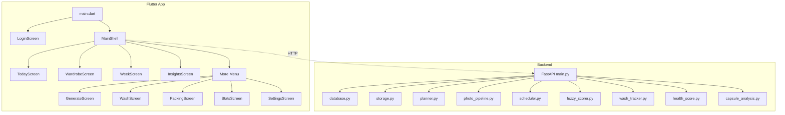

# Smart Wardrobe — Build Walkthrough

## What Was Built

A complete **AI-powered wardrobe management system** with:
- **Python FastAPI backend** (16 files) — SQLite database, local storage, outfit scoring, 7-day planner, wash tracking, capsule analysis
- **Flutter/Dart Android app** (17 files) — Leica × Editorial dark theme, 11 screens, 5 shared components

---

## Architecture



## File Inventory

### Backend (`backend/`)

| File | Purpose |
|------|---------|
| [main.py](file:///c:/Users/Vatsal/Desktop/SMart%20wardrobe/backend/main.py) | All API endpoints: auth, wardrobe, recommendations, planner, insights, packing, stats |
| [database.py](file:///c:/Users/Vatsal/Desktop/SMart%20wardrobe/backend/database.py) | SQLite with 7 tables |
| [storage.py](file:///c:/Users/Vatsal/Desktop/SMart%20wardrobe/backend/storage.py) | Local file storage (replaces R2) |
| [cache.py](file:///c:/Users/Vatsal/Desktop/SMart%20wardrobe/backend/cache.py) | In-memory TTL cache |
| [job_queue.py](file:///c:/Users/Vatsal/Desktop/SMart%20wardrobe/backend/job_queue.py) | Async rate-limited queue |
| [planner.py](file:///c:/Users/Vatsal/Desktop/SMart%20wardrobe/backend/planner.py) | 7-day outfit planner |
| [photo_pipeline.py](file:///c:/Users/Vatsal/Desktop/SMart%20wardrobe/backend/photo_pipeline.py) | Background removal + thumbnails |
| [notifications.py](file:///c:/Users/Vatsal/Desktop/SMart%20wardrobe/backend/notifications.py) | Stub notification system |
| [scheduler.py](file:///c:/Users/Vatsal/Desktop/SMart%20wardrobe/backend/scheduler.py) | APScheduler with 6 background jobs |
| [wash_tracker.py](file:///c:/Users/Vatsal/Desktop/SMart%20wardrobe/backend/wash_tracker.py) | Wash urgency + batch alerts |
| [health_score.py](file:///c:/Users/Vatsal/Desktop/SMart%20wardrobe/backend/health_score.py) | 4-component wardrobe health score |
| [capsule_analysis.py](file:///c:/Users/Vatsal/Desktop/SMart%20wardrobe/backend/capsule_analysis.py) | Versatility, orphans, gaps, color story |
| [modules/weather_client.py](file:///c:/Users/Vatsal/Desktop/SMart%20wardrobe/backend/modules/weather_client.py) | Open-Meteo weather API |
| [modules/color_harmony.py](file:///c:/Users/Vatsal/Desktop/SMart%20wardrobe/backend/modules/color_harmony.py) | HSL-based color scoring |
| [modules/fuzzy_scorer.py](file:///c:/Users/Vatsal/Desktop/SMart%20wardrobe/backend/modules/fuzzy_scorer.py) | Multi-factor outfit scoring |

### Flutter App (`smart_wardrobe_app/lib/`)

| File | Purpose |
|------|---------|
| [main.dart](file:///c:/Users/Vatsal/Desktop/SMart%20wardrobe/smart_wardrobe_app/lib/main.dart) | Entry point, routing, bottom nav shell |
| [theme.dart](file:///c:/Users/Vatsal/Desktop/SMart%20wardrobe/smart_wardrobe_app/lib/theme.dart) | Leica × Editorial design system |
| [services/api.dart](file:///c:/Users/Vatsal/Desktop/SMart%20wardrobe/smart_wardrobe_app/lib/services/api.dart) | Complete HTTP API client |
| [providers/auth_provider.dart](file:///c:/Users/Vatsal/Desktop/SMart%20wardrobe/smart_wardrobe_app/lib/providers/auth_provider.dart) | Auth state management |
| [screens/login_screen.dart](file:///c:/Users/Vatsal/Desktop/SMart%20wardrobe/smart_wardrobe_app/lib/screens/login_screen.dart) | Login with server URL config |
| [screens/today_screen.dart](file:///c:/Users/Vatsal/Desktop/SMart%20wardrobe/smart_wardrobe_app/lib/screens/today_screen.dart) | Daily outfit recommendation |
| [screens/wardrobe_screen.dart](file:///c:/Users/Vatsal/Desktop/SMart%20wardrobe/smart_wardrobe_app/lib/screens/wardrobe_screen.dart) | Grid with category filters |
| [screens/add_item_screen.dart](file:///c:/Users/Vatsal/Desktop/SMart%20wardrobe/smart_wardrobe_app/lib/screens/add_item_screen.dart) | Photo, attributes, sliders |
| [screens/week_screen.dart](file:///c:/Users/Vatsal/Desktop/SMart%20wardrobe/smart_wardrobe_app/lib/screens/week_screen.dart) | 7-day planner |
| [screens/wash_screen.dart](file:///c:/Users/Vatsal/Desktop/SMart%20wardrobe/smart_wardrobe_app/lib/screens/wash_screen.dart) | Batch wash tracker |
| [screens/generate_screen.dart](file:///c:/Users/Vatsal/Desktop/SMart%20wardrobe/smart_wardrobe_app/lib/screens/generate_screen.dart) | On-demand outfit generation |
| [screens/packing_screen.dart](file:///c:/Users/Vatsal/Desktop/SMart%20wardrobe/smart_wardrobe_app/lib/screens/packing_screen.dart) | Packing list generator |
| [screens/insights_screen.dart](file:///c:/Users/Vatsal/Desktop/SMart%20wardrobe/smart_wardrobe_app/lib/screens/insights_screen.dart) | Health score + capsule analysis |
| [screens/stats_screen.dart](file:///c:/Users/Vatsal/Desktop/SMart%20wardrobe/smart_wardrobe_app/lib/screens/stats_screen.dart) | Wardrobe statistics |
| [screens/settings_screen.dart](file:///c:/Users/Vatsal/Desktop/SMart%20wardrobe/smart_wardrobe_app/lib/screens/settings_screen.dart) | Profile, notifications, API key |

---

## How to Run

### Backend
```bash
cd backend
pip install -r requirements.txt
python main.py
```
Server starts at `http://localhost:8000`. API docs at `http://localhost:8000/docs`.

### Flutter App
```bash
cd smart_wardrobe_app
flutter pub get
flutter run
```

> **Note:** The Flutter app defaults to `http://10.0.2.2:8000` (Android emulator). You can change the server URL on the login screen.

---

## Verification Results

| Check | Result |
|-------|--------|
| Dart analyzer | ✅ 0 errors |
| `dart fix --apply` | ✅ 6 fixes auto-applied |
| Python syntax check | ✅ 16 files compiled OK |
| Dependencies installed | ✅ 65 Flutter packages resolved |
